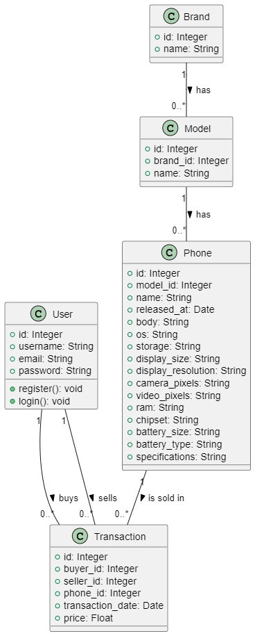
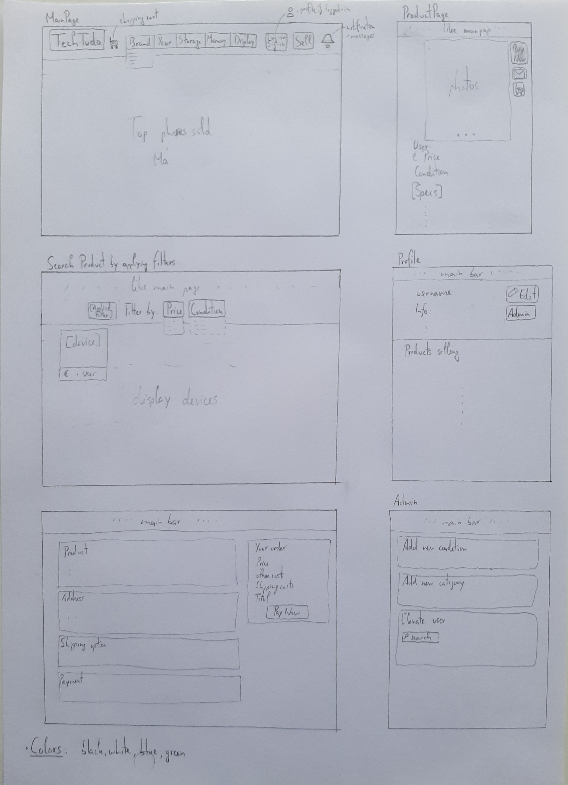

# TechTudo

In this project we developed a website, TechTudo, that facilitates the buying and selling of pre-loved phones.

## Group ltw04g03

- Ricardo Parreira (up202205091) 40%
- Álvaro Torres (up202208954) 40%
- Guilherme Ferreira (up202207524) 20%

## Install Instructions

    git clone https://github.com/FEUP-LTW-2024/ltw-project-2024-ltw04g03.git
    git checkout final-delivery-v1
    
    The database is already ready. The only thing that shall be done is create a new user with the username *ricardo*.

    php -S localhost:9000

## Screenshots

(2 or 3 screenshots of your website)

## Database and project UML diagram

## Database

[Database Folder](./database)

## Mockups

## Implemented Features

**General**:

- [ ] Register a new account.
- [ ] Log in and out.
- [ ] Edit their profile, including their name, username, password, and email.

**Sellers**  should be able to:

- [ ] List new items, providing details such as brand, model, a description of the product, condition, location, price, along with an image of the product.
- [ ] Track and manage their listed items.
- [ ] Respond to inquiries from buyers regarding their items and add further information if needed.
- [ ] Print shipping forms for items that have been sold.

**Buyers**  should be able to:

- [ ] Browse items using filters like category, price, and condition.
- [ ] Engage with sellers to ask questions or negotiate prices.
- [ ] Add items to a wishlist or shopping cart.
- [ ] Proceed to checkout with their shopping cart (simulate payment process).

**Admins**  should be able to:

- [ ] Elevate a user to admin status.
- [ ] Delete Ads.
- [ ] Oversee and ensure the smooth operation of the entire system.

**Security**:
We have been careful with the following security aspects:

- [ ] **SQL injection**
- [ ] **Cross-Site Scripting (XSS)**
- [ ] **Cross-Site Request Forgery (CSRF)**

**Password Storage Mechanism**: hash_password&verify_password

**Aditional Requirements**:

We also implemented the following additional requirements (you can add more):

- [ ] **Shipping Costs**